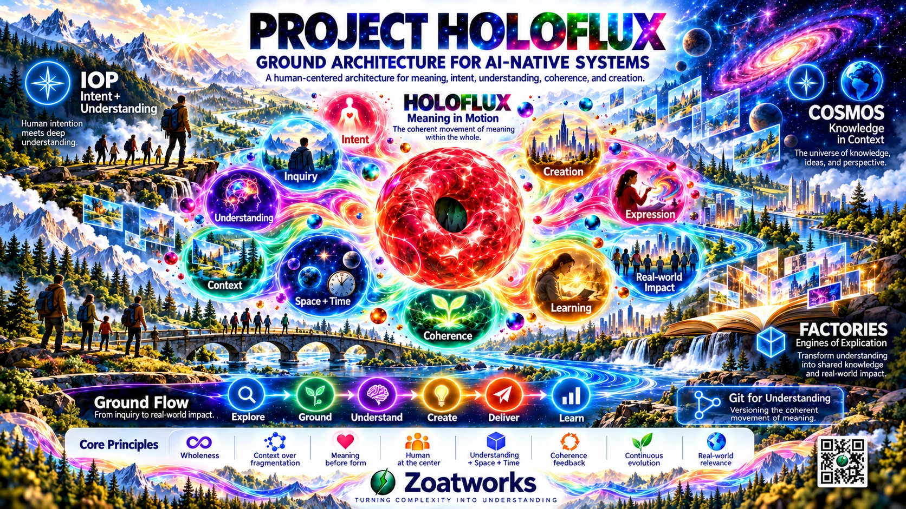
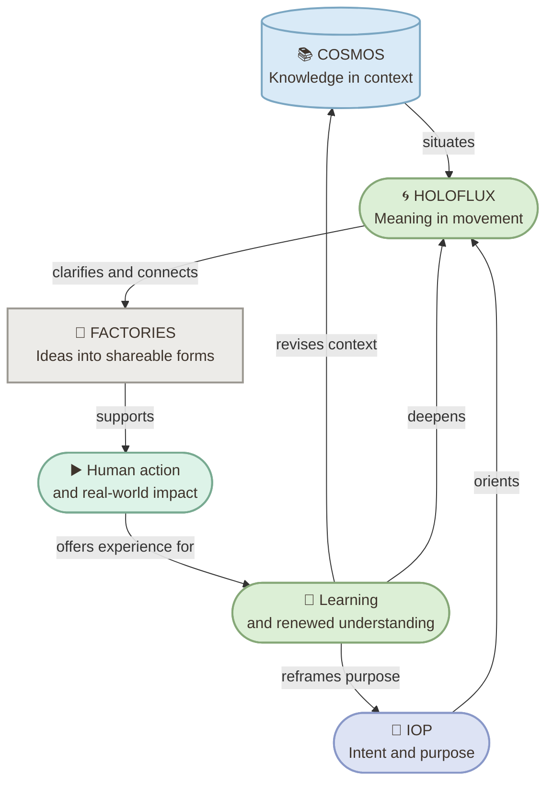
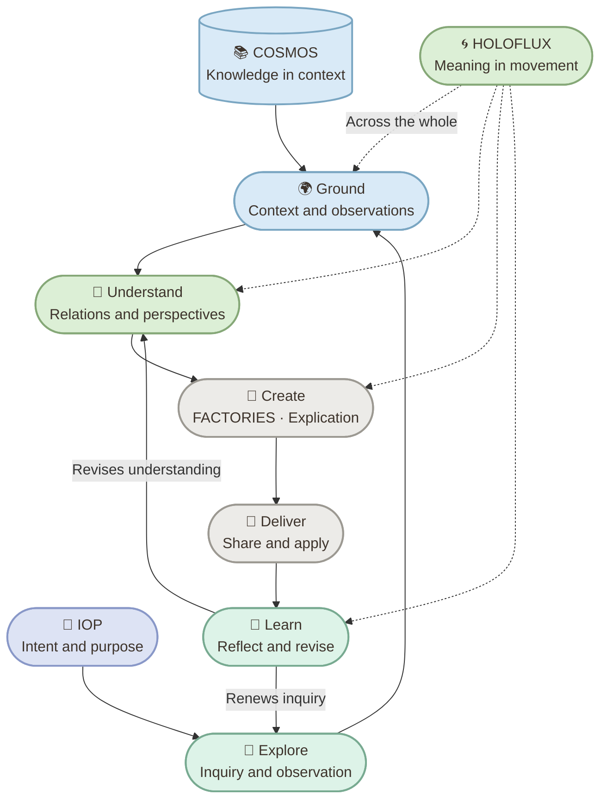

# Project HOLOFLUX

**Ground Architecture** is a human-centered approach to AI-native systems, connecting intent, knowledge, and understanding through the coherent movement of meaning.

At its center, **HOLOFLUX** enables meaning to evolve across context, space, and time—transforming understanding into expression, purposeful action, and continuous learning.

## Contents

- [Summary](#summary)
- [Ground Architecture](#ground-architecture)
- [Concepts Map](#concepts-map)
- [Conceptual Architecture](#conceptual-architecture)
- [Key Concepts](#key-concepts)
- [Guiding Principles](#guiding-principles)
- [Scope](#scope)
- [References](#references)

## Summary

Ground Architecture brings together four complementary perspectives:

- **COSMOS** gives knowledge a navigable context across domains.
- **IOP** starts with human intent: purpose, questions, and the situation to address.
- **HOLOFLUX** connects intent and context to meaning, understanding, and expression.
- **FACTORIES** help turn structured meaning into clear, shareable forms.

Together, they describe a human-centered cycle: explore a wider context, develop understanding, create and share useful forms, then learn from the result. The cycle is iterative; experience can reshape both understanding and intent.

## Ground Architecture

The four names describe roles in a shared conceptual landscape, not separate product components:

| Perspective | Public meaning | Contribution |
| --- | --- | --- |
| **COSMOS** | Knowledge in context | Connects ideas, contexts, and perspectives into a wider view. |
| **IOP** | People in action | Organizes work around purpose, questions, and meaningful outcomes. |
| **HOLOFLUX** | Meaning in movement | Bridges implicit meaning and explicit expression through inquiry and reflection. |
| **FACTORIES** | Ideas into impact | Explicates understanding into communicable forms for people and audiences. |

## Concepts Map

The map shows how the four perspectives relate at a high level. The arrows describe conceptual relationships, not technical integrations.

## Conceptual Architecture

This view follows the recurring Ground Flow: **Explore → Ground → Understand → Create → Deliver → Learn**. *Ground* means situating inquiry within context and available observations. The stages are connected and revisitable. HOLOFLUX describes meaning in movement across the whole, not an isolated processing step.

## Key Concepts

- **Intent:** The purpose, questions, goals, and context that give work direction.
- **Knowledge in context:** Ideas and perspectives considered in relation to one another rather than in isolation.
- **Meaning:** Concepts, relationships, and perspectives that help people make sense of a situation.
- **Inquiry:** Exploring questions and observations while remaining open to what is not yet understood.
- **Coherence:** Considering whether interpretations fit their context while recognizing uncertainty.
- **Space and time:** Understanding is situated and may evolve across contexts and moments.
- **Perspectives:** Each expression reveals aspects of a larger whole without exhausting it.
- **Explication:** Making understanding visible and communicable through forms such as explanations, diagrams, or other media.
- **Learning and revision:** Using reflection and experience to refine understanding and reopen inquiry.
- **Human-centered action:** Applying understanding in ways that remain connected to people's needs and judgment.

## Guiding Principles

- Put people and meaning before form.
- Prefer context and connection over fragmentation.
- Use clear expression to make understanding visible.
- Treat any single representation as partial; different forms can reveal different aspects.
- Keep intent and context traceable through the work.
- Make room for reflection, revision, uncertainty, and continuous learning.
- Treat coherence as an ongoing inquiry, not a guarantee of correctness.
- Recognize that understanding evolves across context, space, and time.
- Connect insight to relevant, real-world outcomes.

## An Exploration: Git for Understanding

Git helps us follow how artifacts change. HOLOFLUX explores a related question: **How might we follow how understanding changes—and why?** This is a conceptual direction, not a claim of an implemented version-control capability for meaning.

## Scope

This README describes the public concepts and relationships represented by the project materials. Its diagrams are explanatory models, not implementation, deployment, or product-component specifications. They intentionally omit internal technical choices and operational details.

## References

- [Ground Architecture cover](images/ground-architecture-blog-cover.webp)
- [Ground Architecture infographic](infographs/infograph-ground-architecture-a4.png)
- [HOLOFLUX overview infographic](src/holoflux/infographs/infograph-holoflux-a3-paisagem.png)
- [AI-native systems infographic](src/holoflux/infographs/linkedin/infograph-ai-native-systems.png)

